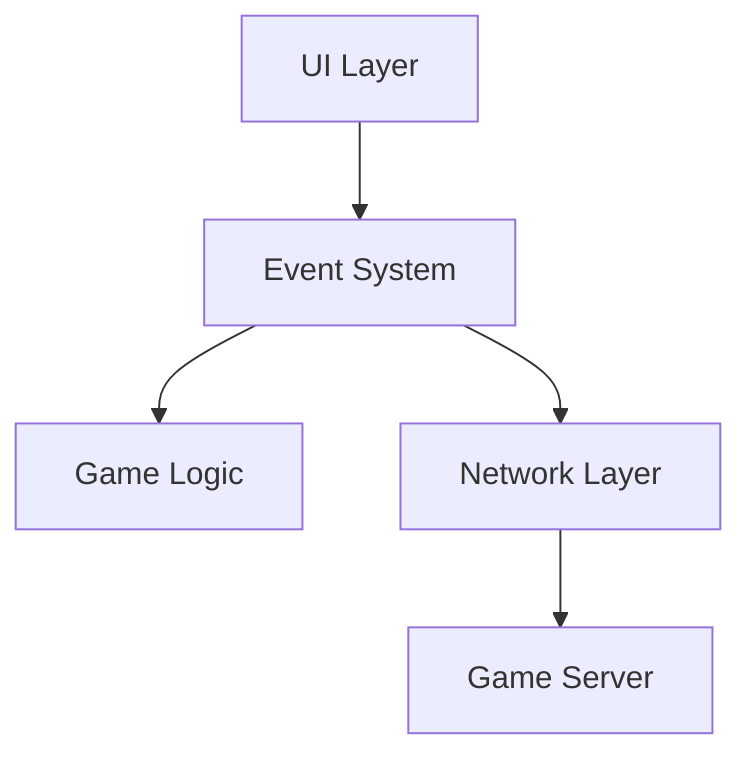
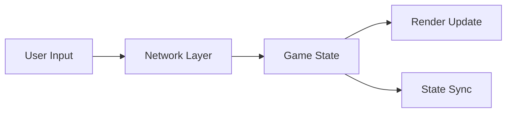

# Outdoor Miner: Hex-based Territory Game

## Quick Start
1. Clone repository
2. Install dependencies: `npm install`
3. Start server: `npm start`
4. Access game: `http://localhost:10000`

## Overview
A modular, extensible hex-based territory capture game built with modern JavaScript.

### Core Features
- Hexagonal grid-based gameplay
- Real-time multiplayer
- Event-driven architecture
- Modular design for easy extension

### Core Mechanics

- **Board**: 16x16 hexagonal grid
- **Players**: 2 players (online multiplayer)
- **Colors**: 5 unique colors
  - Red (#F76C6C)
  - Blue (#374785)
  - Yellow (#F8E9A1)
  - Green (#50C878)
  - Purple (#9B59B6)
- **Capture Mechanics**:
  1. Start from player's territory
  2. When selecting a color:
     - Capture ALL adjacent unclaimed tiles of that color
     - PLUS any connected tiles of the same color (chain reaction)
     - Can capture tiles far from territory through color chains
     - All captured tiles become part of player's territory
  3. Territory Conversion:
     - All owned tiles change to selected color
     - New captures also change to selected color
  4. Strategic Element:
     - Look for "veins" of same-colored tiles
     - Can rapidly expand territory through chain captures
     - Block opponent's potential chain captures

### Technical Implementation

- **Canvas-based rendering** with dynamic scaling
- **WebSocket communication** for real-time gameplay
- **Event-driven architecture** for game state management
- **Responsive design** adapting to various screen sizes

## Development Status (Feb 2024)

### Current Sprint Focus
1. Connection Flow Fixes
   - [x] Room code generation
   - [x] Player 2 join process
   - [ ] Connection status feedback
   - [ ] Error handling improvements

2. Game State Management
   - [x] Initial state setup
   - [x] Turn management
   - [ ] Proper state sync
   - [ ] Disconnect recovery

3. UI Improvements
   - [x] Game code display
   - [x] Player status indicators
   - [ ] Loading states
   - [ ] Error messages

### Known Issues
1. Player Connection
   ```javascript
   // Current Flow Problems
   Player 1 (Host):
   ✓ Creates game successfully
   ✓ Gets connected to server
   ✓ Board initializes
   ⨯ Room code sharing needs testing

   Player 2 (Joining):
   ✓ Can enter name/code
   ✓ Connects to server
   ⨯ Game state sync incomplete
   ⨯ Board rendering issues
   ```

2. Game State
   - State synchronization between players
   - Turn transition handling
   - Score calculation
   - Game end detection

### Immediate Next Steps
1. Test Connection Flow
   ```bash
   # Testing Steps
   1. Start server locally
   2. Open two browsers
   3. Create game in first browser
   4. Note room code display
   5. Join with second browser
   6. Verify both connect
   ```

2. Verify Game State
   ```javascript
   // Key Points to Check
   - Initial board state
   - Turn handling
   - Move validation
   - Score updates
   ```

3. Debug UI Updates
   ```javascript
   // Critical UI Elements
   - Game code display
   - Player info
   - Turn indicator
   - Score display
   ```

## Technical Debt & Open Issues

### Code Structure
1. Circular Dependencies
   - ui.js <-> gameLogic.js have tight coupling
   - Event system needs cleaner separation of concerns

2. Error Handling
   - Many catch blocks log but don't properly recover
   - Network error recovery is incomplete
   - No retry mechanisms for failed connections

3. State Management
   ```javascript
   // Examples of problematic patterns:
   this.lastUsedColor = null; // Global state
   let currentPlayerId = null; // Module-level state
   // TODO: Implement proper state management system
   ```

4. Deferred Decisions
   ```javascript
   // gameLogic.js
   // TODO: Refine worldToHex conversion for accuracy
   console.warn("worldToHex is using axial rounding, may need refinement");

   // server.js
   // Optional: Clean up the game object after delay
   // setTimeout(() => {
   //    if (activeGames[gameId]... 
   // }, 30000);
   ```

### Known Issues

1. Game Synchronization
   - Race conditions in turn transitions
   - State can desync on network hiccups
   - No validation of complete game state

2. Resource Management
   ```javascript
   // Memory leaks possible from:
   - Uncleaned event listeners
   - Stale game states in server memory
   - Unbounded chat message history
   ```

3. UI/UX Gaps
   - No loading states during network operations
   - Missing error feedback for many edge cases
   - Incomplete responsive design

### Future Improvements

1. Core Architecture
   - [ ] Implement proper dependency injection
   - [ ] Add state management library
   - [ ] Create proper service layer

2. Testing
   - [ ] Add unit tests for game logic
   - [ ] Add integration tests for network code
   - [ ] Add E2E tests for full game flow

3. Performance
   - [ ] Optimize render loop
   - [ ] Implement proper garbage collection
   - [ ] Add request debouncing

4. User Experience
   - [ ] Add proper loading states
   - [ ] Improve error messages
   - [ ] Add game replays

### Simplifications That Need Review
1. Board Generation
   ```javascript
   // Currently using simple random generation
   // TODO: Implement proper board balancing
   const randomColor = CONFIG.GAME_COLORS[
       Math.floor(Math.random() * CONFIG.GAME_COLORS.length)
   ];
   ```

2. Move Validation
   ```javascript
   // Simplified move checking
   // TODO: Add proper path finding
   if (this.findCapturableTiles(playerId, selectedColor).length === 0) {
       return { valid: false, reason: 'No valid captures' };
   }
   ```

3. Network Protocol
   ```javascript
   // Basic WebSocket implementation
   // TODO: Add proper protocol versioning
   // TODO: Add message validation
   socket.emit('game-update', result.newState);
   ```

### Security Considerations
1. Input Validation
   - [ ] Add proper sanitization for chat
   - [ ] Validate all network messages
   - [ ] Add rate limiting

2. Game Logic
   - [ ] Add server-side move validation
   - [ ] Prevent state manipulation
   - [ ] Add anti-cheat measures

## Architecture

### Core Systems


### Core Components
```
/OutdoorMiner
├── server/
│   └── server.js       # Game server & socket handling
├── client/
│   ├── network.js      # Client networking
│   ├── gameLogic.js    # Game rules & state
│   └── ui.js          # User interface
└── shared/
    └── constants.js    # Shared configurations
```

### State Flow


### Event System
- UIEvents: User interactions
- NetworkEvents: Connection/sync
- GameEvents: Game state changes

## Configuration

### Environment Variables
```env
PORT=10000
CLIENT_URL=https://jwilliamcase.github.io/OutdoorMiner
NODE_ENV=production
```

### Game Settings
```javascript
const CONFIG = {
    BOARD_SIZE: 16,
    HEX_SIZE: 30,
    GAME_COLORS: [
        '#F76C6C', // Red
        '#374785', // Blue
        '#F8E9A1', // Yellow
        '#50C878', // Green
        '#9B59B6'  // Purple
    ]
};
```

## Hex Grid Implementation

### Grid Spacing and Layout
The game uses a pointy-top hexagonal grid with the following key metrics:

1. Basic Hex Geometry:
```js
HEX_SIZE: 25,  // Base size (r)
HEX_HEIGHT: √3 * size  // Height = 2 * size * sin(60°)
HEX_WIDTH: 2 * size    // Width = 2 * size
```

2. Grid Spacing:
- Horizontal spacing: 1.5 * size (75% of hex width)
- Vertical spacing: √3 * size (75% of hex height)
- Stagger offset: (√3 * size) / 2

3. Key Files and Functions:
- `constants.js`: Defines basic hex measurements and spacing
- `gameLogic.js`: Handles hex coordinate systems and conversions
- `ui.js`: Manages rendering and visual layout

### Coordinate Systems
We use three coordinate systems:
1. Pixel coordinates (screen space)
2. Axial coordinates (q,r) for game logic
3. Offset coordinates for storage/iteration

### Key Methods
```javascript
// Pixel to Hex conversion (ui.js)
worldToHex(x, y) {
    q = (2/3 * x) / hexSize
    r = (-1/3 * x + √3/3 * y) / hexSize
}

// Hex to Pixel conversion (gameLogic.js)
getHexCenter(q, r) {
    x = q * HORIZONTAL_SPACING
    y = r * VERTICAL_SPACING + (q % 2) * STAGGER_OFFSET
}
```

### Visual Layout Control
The grid appearance is controlled by:
1. `BOARD` constants in `constants.js`:
   - Base hex size
   - Spacing ratios
   - Padding values

2. Rendering in `ui.js`:
   - Canvas sizing
   - Board centering
   - Player view rotation

3. Style properties:
   - Hex border thickness
   - Color fill
   - Selection indicators

### Common Issues and Solutions
1. Hex Overlap:
   - Caused by spacing ratios > 75%
   - Fixed by using proper spacing formulas
   - Verified through Red Blob Games calculations

2. Board Centering:
   - Requires proper padding calculation
   - Accounts for both players' viewports
   - Uses canvas translation for positioning

3. Player 2 Rotation:
   - Implemented via canvas rotation
   - Maintains relative hex positions
   - Preserves click handling accuracy

### References
- Red Blob Games Hex Grid Guide: https://www.redblobgames.com/grids/hexagons/
- Hex Grid Coordinate Systems: axial, offset, cubic
- Canvas Transformation Best Practices

## Testing

```bash
# Run tests
npm test

# Development mode
npm run dev

# Production
npm start
```

## Deployment
Currently deployed on Render:
- Server: https://outdoor-miner-server.onrender.com
- Client: https://jwilliamcase.github.io/OutdoorMiner

### Render Configuration
- Build Command: `npm install`
- Start Command: `node server/server.js`
- Environment: Node.js
- Plan: Free Tier

## Contributing
1. Branch naming: `feature/description` or `fix/issue-name`
2. Commit messages: Clear and descriptive
3. Testing: Add/update tests for changes
4. Documentation: Update README for significant changes

## License
ISC License

## Current Technical Issues (February 2024)

### Immediate Priorities
1. Connection & State Management
   ```javascript
   // Current Issues
   - CORS configuration needs fixing
   - Socket connection management is scattered
   - Turn state management needs centralization
   - Game state sync needs single source of truth
   ```

2. Error Handling
   ```javascript
   // Missing Features
   - Proper error boundaries
   - User feedback for failures
   - Network recovery procedures
   - Validation feedback
   ```

3. Game Flow
   ```javascript
   // Flow Problems
   - Move validation incomplete
   - Turn transitions unreliable
   - State updates inconsistent
   - Score calculation needs verification
   ```

### Known Bugs

1. Connection Issues
   ```javascript
   // Socket Problems
   - CORS warnings in development
   - Reconnection handling incomplete
   - Room cleanup timing issues
   - Player disconnect recovery missing
   ```

2. Game State
   ```javascript
   // State Management
   - Multiple sources of truth
   - Inconsistent state updates
   - Turn state desyncs
   - Score calculation race conditions
   ```

3. UI/UX Issues
   ```javascript
   // Visual & Interaction
   - Color selection sometimes unresponsive
   - Move feedback missing
   - Board centering issues
   - Error message display incomplete
   ```

### Next Steps

1. Immediate Fixes
   ```javascript
   // Priority fixes
   1. Fix turn indicator logic
   2. Implement proper move validation
   3. Add server authority
   4. Fix hex spacing
   ```

2. Technical Debt
   ```javascript
   // Code organization
   1. Consolidate network handlers
   2. Implement proper state management
   3. Add error boundaries
   4. Add comprehensive logging
   ```

3. Future Improvements
   ```javascript
   // Planned features
   1. Replay system
   2. Improved error recovery
   3. Move animation
   4. Better player feedback
   ```

## Current Technical Debt (February 2024)

### Critical Issues

1. State Management & Synchronization
   ```javascript
   // Multiple sources of truth
   - gameState in network.js, ui.js, and server
   - Inconsistent state updates between modules
   - No clear authority for game state
   ```

2. Orphaned Functions & Dead Code
   ```javascript
   // network.js
   - checkDuplicateInstance() not properly integrated
   - reconnectToGame() lacks proper implementation
   - setupSocketEventListeners() called multiple times

   // ui.js
   - handleCanvasClick() not properly connected
   - centerCamera() unused but defined
   - playSound() inconsistently used

   // gameLogic.js
   - worldToHex() implementation incomplete
   - Several validation methods unused
   ```

3. Error Recovery Issues
   ```javascript
   // Missing or incomplete error handling
   - Disconnect/reconnect flow broken
   - Move validation feedback loop incomplete
   - Score update race conditions possible
   ```

### Architecture Problems

1. Module Dependencies
   ```javascript
   // Circular dependencies
   ui.js <--> network.js <--> gameLogic.js
   
   // Unclear responsibility boundaries
   - UI updates happening in network code
   - Game logic split between client/server
   - State management scattered across modules
   ```

2. Configuration Issues
   ```javascript
   // Inconsistent config usage
   - Multiple sources of constants
   - Hardcoded values mixed with CONFIG
   - Development/production config mixing
   ```

3. Event System Problems
   ```javascript
   // Event handling issues
   - Multiple event systems in use
   - Inconsistent event naming
   - Missing event cleanup
   - Potential memory leaks
   ```

### Immediate Tasks

1. Code Cleanup
   - [ ] Consolidate state management
   - [ ] Remove unused functions
   - [ ] Fix circular dependencies
   - [ ] Standardize event system

2. Critical Fixes
   - [ ] Fix move validation
   - [ ] Implement proper scoring
   - [ ] Fix reconnection handling
   - [ ] Add proper error boundaries

3. Testing Gaps
   - [ ] Add unit tests for game logic
   - [ ] Add integration tests for network
   - [ ] Add UI component tests

### Known Bugs

1. Game State
   ```javascript
   // Turn Management
   - Double turn notifications
   - Turn state desyncs
   - Score calculation errors

   // Move Validation
   - Invalid moves sometimes allowed
   - Move feedback missing
   - Capture validation incomplete
   ```

2. UI Issues
   ```javascript
   // Visual Bugs
   - Hex overlap on certain zoom levels
   - Color update delays
   - Score display inconsistencies

   // Interaction Problems
   - Click handling unreliable
   - Color selection sometimes unresponsive
   - Board centering issues
   ```

3. Network Issues
   ```javascript
   // Connection Problems
   - Reconnection handling broken
   - Room cleanup inconsistent
   - Player disconnect handling unreliable
   ```

### Code Review Notes

1. Performance Concerns
   ```javascript
   // Potential bottlenecks
   - Large game state objects
   - Frequent board redraws
   - Unnecessary state updates
   - Memory leaks in event listeners
   ```

2. Security Issues
   ```javascript
   // Current vulnerabilities
   - Missing input sanitization
   - No rate limiting
   - Insufficient move validation
   - Potential state manipulation
   ```

3. Maintainability Issues
   ```javascript
   // Code quality problems
   - Inconsistent error handling
   - Poor documentation
   - Mixed responsibilities
   - Duplicate code across modules
   ```

### Next Steps

1. Immediate Priorities
   ```javascript
   // Critical fixes needed
   1. Consolidate state management
   2. Fix move validation
   3. Implement proper error handling
   4. Clean up event system
   ```

2. Medium Term
   ```javascript
   // Important improvements
   1. Add comprehensive testing
   2. Refactor module structure
   3. Improve error recovery
   4. Add proper logging
   ```

3. Long Term
   ```javascript
   // Future considerations
   1. Implement proper state management
   2. Add replay system
   3. Improve performance
   4. Add advanced features
   ```
