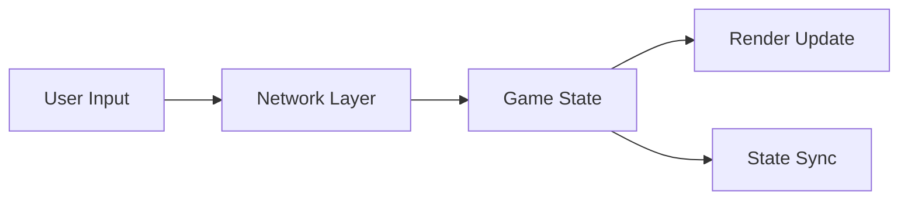

# Outdoor Miner: Hex Territory Game

## Quick Start
1. Clone repository
2. Install dependencies: `npm install`
3. Start server: `npm start`
4. Access game: `http://localhost:10000`

## Game Overview

A multiplayer territory capture game played on a hexagonal grid. Players compete to control territory by strategically selecting colors and expanding their influence.

### Core Mechanics

- **Board**: 16x16 hexagonal grid
- **Players**: 2 players (online multiplayer)
- **Colors**: 5 unique colors
  - Red (#F76C6C)
  - Blue (#374785)
  - Yellow (#F8E9A1)
  - Green (#50C878)
  - Purple (#9B59B6)
- **Gameplay Loop**:
  1. Players start from opposite corners
  2. Each turn: select a color to capture adjacent matching tiles
  3. Captured tiles + owned territory change to selected color
  4. Cannot use opponent's last-used color
  5. Game ends when board is filled
  6. Winner: Player with most territory

### Technical Implementation

- **Canvas-based rendering** with dynamic scaling
- **WebSocket communication** for real-time gameplay
- **Event-driven architecture** for game state management
- **Responsive design** adapting to various screen sizes

## Development Status (Feb 2024)

### Current Sprint Focus
1. Connection Flow Fixes
   - [x] Room code generation
   - [x] Player 2 join process
   - [ ] Connection status feedback
   - [ ] Error handling improvements

2. Game State Management
   - [x] Initial state setup
   - [x] Turn management
   - [ ] Proper state sync
   - [ ] Disconnect recovery

3. UI Improvements
   - [x] Game code display
   - [x] Player status indicators
   - [ ] Loading states
   - [ ] Error messages

### Known Issues
1. Player Connection
   ```javascript
   // Current Flow Problems
   Player 1 (Host):
   ✓ Creates game successfully
   ✓ Gets connected to server
   ✓ Board initializes
   ⨯ Room code sharing needs testing

   Player 2 (Joining):
   ✓ Can enter name/code
   ✓ Connects to server
   ⨯ Game state sync incomplete
   ⨯ Board rendering issues
   ```

2. Game State
   - State synchronization between players
   - Turn transition handling
   - Score calculation
   - Game end detection

### Immediate Next Steps
1. Test Connection Flow
   ```bash
   # Testing Steps
   1. Start server locally
   2. Open two browsers
   3. Create game in first browser
   4. Note room code display
   5. Join with second browser
   6. Verify both connect
   ```

2. Verify Game State
   ```javascript
   // Key Points to Check
   - Initial board state
   - Turn handling
   - Move validation
   - Score updates
   ```

3. Debug UI Updates
   ```javascript
   // Critical UI Elements
   - Game code display
   - Player info
   - Turn indicator
   - Score display
   ```

## Technical Debt & Open Issues

### Code Structure
1. Circular Dependencies
   - ui.js <-> gameLogic.js have tight coupling
   - Event system needs cleaner separation of concerns

2. Error Handling
   - Many catch blocks log but don't properly recover
   - Network error recovery is incomplete
   - No retry mechanisms for failed connections

3. State Management
   ```javascript
   // Examples of problematic patterns:
   this.lastUsedColor = null; // Global state
   let currentPlayerId = null; // Module-level state
   // TODO: Implement proper state management system
   ```

4. Deferred Decisions
   ```javascript
   // gameLogic.js
   // TODO: Refine worldToHex conversion for accuracy
   console.warn("worldToHex is using axial rounding, may need refinement");

   // server.js
   // Optional: Clean up the game object after delay
   // setTimeout(() => {
   //    if (activeGames[gameId]... 
   // }, 30000);
   ```

### Known Issues

1. Game Synchronization
   - Race conditions in turn transitions
   - State can desync on network hiccups
   - No validation of complete game state

2. Resource Management
   ```javascript
   // Memory leaks possible from:
   - Uncleaned event listeners
   - Stale game states in server memory
   - Unbounded chat message history
   ```

3. UI/UX Gaps
   - No loading states during network operations
   - Missing error feedback for many edge cases
   - Incomplete responsive design

### Future Improvements

1. Core Architecture
   - [ ] Implement proper dependency injection
   - [ ] Add state management library
   - [ ] Create proper service layer

2. Testing
   - [ ] Add unit tests for game logic
   - [ ] Add integration tests for network code
   - [ ] Add E2E tests for full game flow

3. Performance
   - [ ] Optimize render loop
   - [ ] Implement proper garbage collection
   - [ ] Add request debouncing

4. User Experience
   - [ ] Add proper loading states
   - [ ] Improve error messages
   - [ ] Add game replays

### Simplifications That Need Review
1. Board Generation
   ```javascript
   // Currently using simple random generation
   // TODO: Implement proper board balancing
   const randomColor = CONFIG.GAME_COLORS[
       Math.floor(Math.random() * CONFIG.GAME_COLORS.length)
   ];
   ```

2. Move Validation
   ```javascript
   // Simplified move checking
   // TODO: Add proper path finding
   if (this.findCapturableTiles(playerId, selectedColor).length === 0) {
       return { valid: false, reason: 'No valid captures' };
   }
   ```

3. Network Protocol
   ```javascript
   // Basic WebSocket implementation
   // TODO: Add proper protocol versioning
   // TODO: Add message validation
   socket.emit('game-update', result.newState);
   ```

### Security Considerations
1. Input Validation
   - [ ] Add proper sanitization for chat
   - [ ] Validate all network messages
   - [ ] Add rate limiting

2. Game Logic
   - [ ] Add server-side move validation
   - [ ] Prevent state manipulation
   - [ ] Add anti-cheat measures

## Architecture

### Core Components
```
/OutdoorMiner
├── server/
│   └── server.js       # Game server & socket handling
├── client/
│   ├── network.js      # Client networking
│   ├── gameLogic.js    # Game rules & state
│   └── ui.js          # User interface
└── shared/
    └── constants.js    # Shared configurations
```

### State Flow


### Event System
- UIEvents: User interactions
- NetworkEvents: Connection/sync
- GameEvents: Game state changes

## Configuration

### Environment Variables
```env
PORT=10000
CLIENT_URL=https://jwilliamcase.github.io/OutdoorMiner
NODE_ENV=production
```

### Game Settings
```javascript
const CONFIG = {
    BOARD_SIZE: 16,
    HEX_SIZE: 30,
    GAME_COLORS: [
        '#F76C6C', // Red
        '#374785', // Blue
        '#F8E9A1', // Yellow
        '#50C878', // Green
        '#9B59B6'  // Purple
    ]
};
```

## Testing

```bash
# Run tests
npm test

# Development mode
npm run dev

# Production
npm start
```

## Deployment
Currently deployed on Render:
- Server: https://outdoor-miner-server.onrender.com
- Client: https://jwilliamcase.github.io/OutdoorMiner

### Render Configuration
- Build Command: `npm install`
- Start Command: `node server/server.js`
- Environment: Node.js
- Plan: Free Tier

## Contributing
1. Branch naming: `feature/description` or `fix/issue-name`
2. Commit messages: Clear and descriptive
3. Testing: Add/update tests for changes
4. Documentation: Update README for significant changes

## License
ISC License
